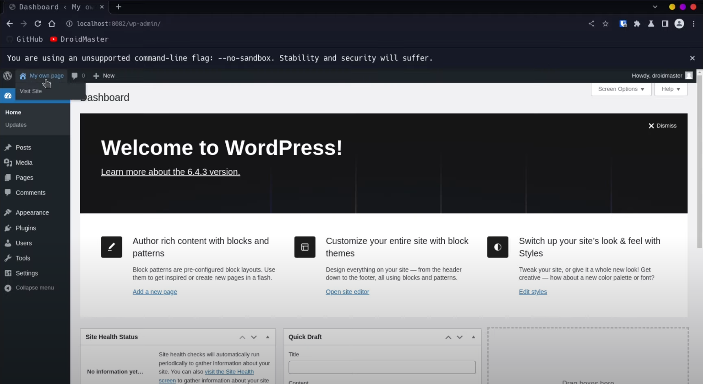
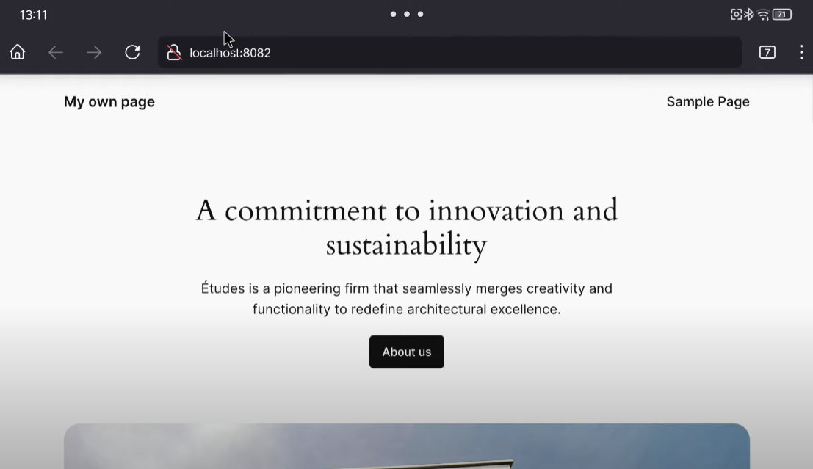

# LAMP Server on Android with Termux (Apache - MySQL - PHP)

Here are the commands you need to configure a LAMP server in Termux. This will allow you to host your own web pages such as a Wordpress page on your Android device.

All this process is documented in the following video: [How to install a LAMP web server on Termux](https://www.youtube.com/watch?v=3NKR_SGlTtY)




## 1. Setup Apache
1. Install Apache: 
```
sudo apt-get install apache2 -y
```
2. Modify the default port (the port 80 is restricted)
```
nano /etc/apache2/ports.conf
```
And change the line: 'Listen 80' to the port you want (for example, port 8082)

3. Start the Apache service
```
sudo service apache2 start
```
In case you want to check the status of the service (it should say 'apache2 is running'): 
```
sudo service apache2 status
```
4. Go to http://localhost:8082 and check that the Apache2 service works


## 2. Install PHP
1. Install PHP: 
```
sudo apt-get install php -y
```
2. To test that PHP is working go to `/var/www/html` and create a new index.php witht the following command (remove the index file first with `rm index.html`)
```
<?php phpinfo(); ?>
```

## 3. Install MariaDB (MySQL)
1. Install MariaDB: 
```
sudo apt-get install mariadb-server php-mysql -y
```
2. Run the MariaDB service: 
```
mysqld_safe
```

3. Open a new tab in the terminal and run the secure installation: 
```
sudo mysql_secure_installation
```
For the recommended configuration I suggest taking a look at the video in the top of this file

4. Let's access the MySQL server and create the database needed for Wordpress: 
```
sudo mysql -uroot -p
```
```
create database wordpress;
```
```
GRANT ALL PRIVILEGES ON wordpress.* TO 'root'@'localhost' IDENTIFIED BY 'YOURPASSWORD';
```
```
FLUSH PRIVILEGES;
```


## 4. Install WordPress
1. Download Wordpress latest version (firs move to the default apache path `cd /var/www/html/`): 
```
sudo wget https://wordpress.org/latest.tar.gz
```
In case you need to install wget: `sudo apt install wget -y`

2. Extract WordPress: 
```
sudo tar xzf latest.tar.gz
```

3. Move the extracted content to the current direcoty
```
sudo mv wordpress/* .
```

4. Remove unnecesary files
```
sudo rm -rf wordpress latest.tar.gz
```

5. Set permissions to the files
```
sudo chown -R www-data: .
```

## Acknowledgements
I have obtained most of the information here from the following link: [How to install a LAMP server on a raspberry pi](https://projects.raspberrypi.org/en/projects/lamp-web-server-with-wordpress/2)